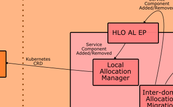

# HLO Local Allocation Manager
Component of the HLO responsible for receiveing servcie component LCM requests and address LLOs.

## Description
Exposing endpoint for service component LCM.
Receiving input from Inter-domain Allocation/Migration Manager from the same domain or from an external aeriOS domain
Produce CRD and send to LLO responsible for selected IE.

## Visuals
| HLO AL EP & LAM component | HLO AL EP openAPI |
|----------|----------|
|   |     |


## Usage
For development, 
   * git clone
   * cd hlo-deployment-engine
   * python3 -m venv venv
   * pip install -r requirments
   * source venv/bin/activate
   * uvicorn main:app --reload
   * Import postman collection, configure collection env parameters and test endpoints


## Deployment
For deploying in aeriOS domain.Easier when using Makefile. 
Edit variables, if needed, and :

* Build and tag docker image
```
 make build
```
* Push to aeriOS repository
```
 make push
```
* Package and upload helm chart
```
 make helm-upload
```
* Deploy against cluster chosen as current k8s context
```
 make deploy
```
* All the above
```
 make all
```
* Removes docker image
```
 make clean-build
```
* Removes the helm deployment from the cluster
```
 make clean-deploy 
```
* Removes all the above
```
 make clean-all 
```


## Authors and Support
Vasilis Pitsilis: vpitsilis@{dat,iit}.demokritos.gr 

Andreas Sakellaropoulos: asakellaropoulos@iit.demokritos.gr


## Support
Please use Mattermost T3.3 channel,
or mail to vpitsilis@dat.demokritos.gr, vpitsilis@iit.demokritos.gr, asakellaropoulos@iit.demokritos.gr

## License
Copyright 2023.

Licensed under the Apache License, Version 2.0 (the "License"); you may not use this file except in compliance with the License. You may obtain a copy of the License at

    http://www.apache.org/licenses/LICENSE-2.0

Unless required by applicable law or agreed to in writing, software distributed under the License is distributed on an "AS IS" BASIS, WITHOUT WARRANTIES OR CONDITIONS OF ANY KIND, either express or implied. See the License for the specific language governing permissions and limitations under the License.

```